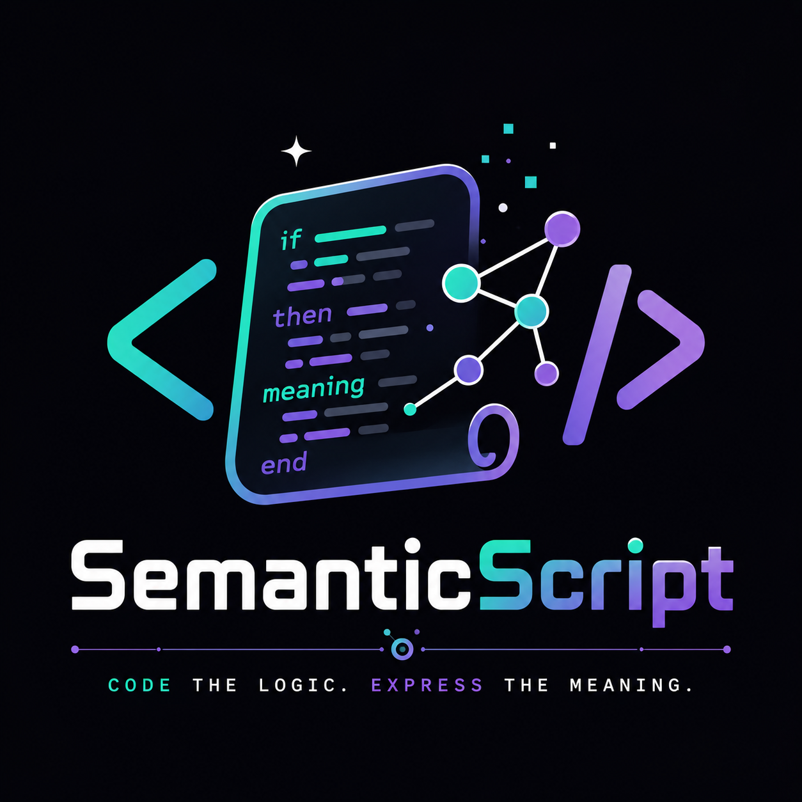

# SemanticScript

[](https://github.com/monstercameron/SemanticScript/blob/main/version.json)
[](https://github.com/monstercameron/SemanticScript/actions/workflows/ci.yml)
[](LICENSE)

<p align="center">
  <a href="https://monstercameron.github.io/SemanticScript/">
    
  </a>
</p>

<p align="center">
  
</p>

Project site: <https://monstercameron.github.io/SemanticScript/>

SemanticScript is a pre-release, agent-first application language and toolchain
for code that should be easy to inspect, repair, and validate.

It is built around explicit, line-addressable source records: operations name
their effects, capabilities, memory behavior, failure paths, runtime edges, and
review intent directly in the source. The goal is not terse code. The goal is
source that gives humans, agents, editors, linters, and compilers enough context
to make careful changes without reconstructing intent from framework convention
or expression nesting.

Current release status: `0.0.1` pre-release. No stable public release has been
published yet. Main-branch prerelease builds are published on
[GitHub Releases](https://github.com/monstercameron/SemanticScript/releases)
with a Windows `sem.exe`, VS Code VSIX, and checksum manifest.

Review is especially useful now because the language, compiler, linter,
formatter, editor extension, runtime adapters, docs, and demos are still moving
together. A reviewer can trace one idea from syntax row to parser behavior,
diagnostic, lowering path, editor support, and runnable app. A small PR can
meaningfully improve the project while the compatibility boundary is still
being shaped.

## What Works

- Release-built `sem.exe` CLI for `.sscript` and `.sem`.
- LLVM IR generation, JIT execution, and clang-linked native executables.
- Structured linter, formatter, and semantic diagnostics.
- `sem` CLI for validation, graph/slice retrieval, repair planning, patching,
  readiness checks, and test orchestration.
- VS Code extension for syntax, semantic highlighting, hovers, diagnostics, and
  compiler integration.
- Native runtime adapters for HTTP, SQLite, JSON, bcrypt, HTML templating, and
  selected GUI/terminal surfaces.
- Curated app and runtime demos under `apps/`.

SemanticScript is still evolving. Treat the compatibility boundary in
[docs/reference/compatibility.md](docs/reference/compatibility.md) and the
implementation inventory in
[docs/reference/syntax-inventory.md](docs/reference/syntax-inventory.md) as the
source of truth.

## Install

Download the latest `main-<SHORT_SHA>` prerelease from
[GitHub Releases](https://github.com/monstercameron/SemanticScript/releases).
Each main-channel prerelease includes:

- `semanticscript-sem-windows-x64-main-<SHORT_SHA>.exe`: standalone Windows
  `sem` CLI.
- `semanticscript-vscode-main-<SHORT_SHA>.vsix`: local VS Code extension
  package.
- `semanticscript-merge-release-manifest-main-<SHORT_SHA>.json`: artifact
  metadata and SHA-256 checksums.

Install the compiler CLI on Windows:

```powershell
$InstallDir = "$env:LOCALAPPDATA\Programs\SemanticScript"
New-Item -ItemType Directory -Force -Path $InstallDir | Out-Null
Copy-Item ".\semanticscript-sem-windows-x64-main-<SHORT_SHA>.exe" "$InstallDir\sem.exe"
& "$InstallDir\sem.exe" version --json
```

Install the editor extension from the same release:

```powershell
code --install-extension ".\semanticscript-vscode-main-<SHORT_SHA>.vsix"
```

Add `$InstallDir` to `PATH` if you want to run `sem` from any terminal.

Install LLVM/clang when you need native executable output through `sem build`
or compiler `--emit-exe` paths. See
[docs/toolchain/llvm-compiler-install.md](docs/toolchain/llvm-compiler-install.md).
After LLVM is installed, run `sem doctor` to verify the native backend.

### Package managers and MCP

Tagged `v<version>` releases also publish package-manager and MCP artifacts:

```powershell
# Scoop (after adding the manifest to a bucket)
scoop install semanticscript

# winget
winget install monstercameron.SemanticScript
```

The release includes `semanticscript.mcpb`, a one-click
[MCP Bundle](https://github.com/modelcontextprotocol/mcpb) for desktop clients
such as Claude Desktop. To run the bundled MCP server from an installed `sem`:

```bash
sem mcp                          # stdio transport (default)
claude mcp add semanticscript -- sem mcp
```

See [docs/toolchain/compiler.md](docs/toolchain/compiler.md) ("MCP server") for
transports and the exposed tools. Manifest sources live under `packaging/`
(`scoop/`, `winget/`, `mcpb/`, `registry/`).

## Quickstart

Scaffold a small project:

```powershell
sem new hello-world
sem check --json hello-world
```

Inspect the toolchain and available workflows:

```powershell
sem version --json
sem skills list --json
```

For source checkout development, use the Python driver and test suite directly:

```powershell
python -m pip install -r requirements.txt -c constraints.txt
python SemanticScript\tools\sem.py --version --json
python SemanticScript\tests\run_suite.py ci-fast
```

## Start Reviewing

If you are new to the project, start with one narrow pass:

1. Read [docs/overview.md](docs/overview.md) for the design goal.
2. Check [docs/reference/syntax-inventory.md](docs/reference/syntax-inventory.md)
   to see what is implemented, partial, or metadata-only.
3. Open one demo, such as `apps/taskforge-tui/`, then map it and inspect one
   operation:

   ```powershell
   sem graph --kind summary --json apps/taskforge-tui
   sem slice --operation main --json apps/taskforge-tui
   ```

4. File an issue or PR when something is unclear, inconsistent, under-tested, or
   harder to review than it should be.

Good first reviews often find mismatches between docs and implementation,
confusing diagnostics, missing examples, editor support that moved ahead of the
parser, or demo code that no longer shows the strongest current pattern.

You do not need to design a language feature to help. A clear doc correction,
better diagnostic example, smaller demo, or reproduced mismatch is valuable.

## Language Shape

SemanticScript source is a semantic tape. Each row records one fact.

```semanticscript
operation createTodoHandler
input operation createTodoHandler request HttpRequest
input operation createTodoHandler response HttpResponse
output operation createTodoHandler Int32
effect createTodoHandler read http.request.body
effect createTodoHandler readWrite database
effect createTodoHandler write http.response
useCapability createTodoHandler httpRequestReader
useCapability createTodoHandler httpResponseWriter
useCapability createTodoHandler sqliteDatabaseReadWriter
memory createTodoHandler heap auto
async createTodoHandler no
purpose operation createTodoHandler "Create one todo owned by the authenticated session user."
invariant operation createTodoHandler "The user id comes from the session, never from request JSON."
```

That header is not decoration. It gives tools and reviewers a compact contract:
what the operation reads, writes, allocates, authorizes, and must preserve.

## Tooling Loop

Use `sem` before dropping to compiler or linter internals:

```powershell
sem skills list --json
sem check --json PATH
sem graph --kind summary --json PATH
sem slice --operation NAME --json PATH
sem explain CODE --json
sem fix --plan --json PATH
sem patch --dry-run --json PLAN.json
sem test --json PATH
```

The intended repair loop is:

```text
skills -> check -> graph/slice -> explain -> fix plan -> dry-run patch -> apply -> check -> test
```

## Repository Map

```text
SemanticScript/
  bench/          Experimental benchmark harnesses
  compiler/       Reference compiler
  linter/         Structured diagnostics linter
  formatter/      Source formatter
  runtime/        Native runtime adapters
  std/            Standard library modules
  tests/          Unit, component, integration, and e2e suites

apps/             Curated runnable demos and runtime harnesses
docs/             Maintained documentation
experiments/      Larger research and stress ports
packaging/        Release packaging definitions
vscode-semanticscript/
                  Local VS Code language extension
third_party/      Vendored native dependencies and notices
```

## Demos

- `apps/taskforge-tui/`: console todo app with JSON persistence.
- `apps/html-template-lab/`: compact HTML template and module-split rendering
  demo.
- `apps/http-runtime-gauntlet/`: native HTTP runtime conformance harness.
- `apps/taskforge-web/`: preview multi-user web app with native HTTP, SQLite,
  bcrypt, sessions, static assets, HTML pages, and JSON APIs.
- `apps/desktop-window-smoke/`: minimal Windows GUI smoke fixture.

TaskForge Web is a preview proof point, not a polished product surface. Its
current status is documented in [apps/taskforge-web/README.md](apps/taskforge-web/README.md).

## Benchmarks

Experimental cross-language microbenchmarks live under
[SemanticScript/bench/algorithms](SemanticScript/bench/algorithms). They compare
selected SemanticScript-generated native executables with equivalent C,
JavaScript, and Python implementations on one host. Treat them as codegen
regression fixtures and directional evidence, not a general performance
guarantee.

## Documentation

- [docs/overview.md](docs/overview.md): language and toolchain overview.
- [docs/README.md](docs/README.md): developer documentation entry point.
- [docs/language/README.md](docs/language/README.md): language model.
- [docs/toolchain/compiler.md](docs/toolchain/compiler.md): compiler and
  backend behavior.
- [docs/toolchain/llvm-compiler-install.md](docs/toolchain/llvm-compiler-install.md):
  LLVM/clang installation for native executable builds.
- [docs/toolchain/agent-workflows.md](docs/toolchain/agent-workflows.md):
  agent-facing command loop.
- [docs/toolchain/vscode-extension.md](docs/toolchain/vscode-extension.md):
  editor extension behavior.
- [docs/reference/compatibility.md](docs/reference/compatibility.md): public
  compatibility boundary.
- [docs/reference/roadmap.md](docs/reference/roadmap.md): pre-release roadmap
  and public status.
- [docs/reference/release-hygiene.md](docs/reference/release-hygiene.md):
  release repository-state and package metadata policy.
- [SemanticScript/bench/algorithms/README.md](SemanticScript/bench/algorithms/README.md):
  benchmark methodology, commands, and current single-host results.

## Release And Extension Status

The repository is pre-release. Main-branch merges publish prerelease handoff
builds with `sem.exe`, the local VS Code VSIX, and a manifest. Stable public
version releases will use `v*` tags once the compatibility boundary is ready.

The VS Code extension currently uses `publisher: semanticscript-local` for
local VSIX packaging. Choose a real Marketplace publisher before public
Marketplace distribution.

## Contributing

PRs are welcome. The best contributions are narrow, easy to review, and include
the command or manual check used to validate the change. See
[CONTRIBUTING.md](CONTRIBUTING.md) for setup, branch naming, and review policy.

High-value contribution areas right now:

- Documentation fixes that explain current behavior, status, or limitations more
  clearly.
- Focused compiler, linter, formatter, or editor fixes with tests.
- Diagnostics that explain what went wrong and how to repair it.
- Demo improvements that show the intended SemanticScript style without adding
  unrelated complexity.
- Small runtime or stdlib fixes backed by an app or feature test.

The short version:

- Keep changes scoped.
- Include validation commands in PRs.
- Do not commit generated binaries, `.vsix` files, caches, local databases, or
  build folders.
- Keep docs synchronized with compiler, linter, runtime, and editor behavior.

## Security

Do not report vulnerabilities in public issues. See
[SECURITY.md](SECURITY.md) for private reporting instructions.

## License

SemanticScript is distributed under the [MIT License](LICENSE). Third-party code
under `third_party/` keeps its upstream license terms.
