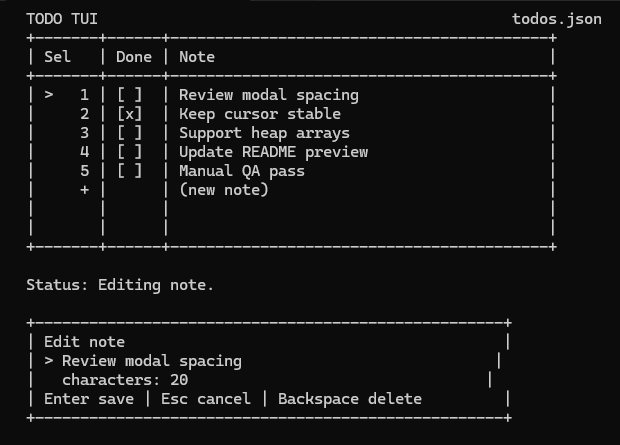

# SemanticScript

SemanticScript is an agent-first application language and toolchain. It is built
around a flat, line-oriented, high-context semantic tape where every executable
line is an atomic semantic record with a strict schema.

The design goal is not short source. The design goal is source that remains
locally understandable inside an agent attention window. SemanticScript spends
tokens on names, effects, types, failure paths, timing, cleanup, and comments so
an agent can edit code without guessing through hidden runtime behavior.

The current implementation is already a real compiler: it emits LLVM IR through
`llvmlite`, can JIT-run programs, and can link native executables through
`clang`. The long-term target is application development in the same problem
space as Node, Python, Bun, Deno, Express, FastAPI, and Go services, but with a
source format optimized for agentic maintenance rather than human terseness.

The repository also contains refined syntax examples under `SemanticScript/sem/`.
Those files explore the next SemanticScript surface: fixed schemas, explicit
dataflow, typed failure edges, guarded mutation, structured async,
trust-boundary metadata, and syntax that is easier for transformer attention to
recover and edit.

## Quick Preview



The current runnable app lives in `app/todo` and renders a keyboard-driven
console todo list backed by `todos.json`.

## Technical Pitch

SemanticScript makes source code a checkable contract tape:

- Every line does one semantic thing.
- Every meaningful element is name-addressable.
- Failure is explicit dataflow, not an implicit exception path.
- Effects are declared next to the operation that performs them.
- Types carry intent, trust, memory, and layout information.
- Cleanup, async, time, and shared-state access are visible in source.
- Comments are semantic context for tools, not just prose.
- Abstractions are valid only when they add contract, checks, or traceability.

The spec's deepest rule is simple:

```text
SemanticScript does not minimize code.
SemanticScript maximizes recoverable context.
```

That means SemanticScript deliberately repeats operation names, argument names,
types, call names, branch labels, and failure values. The compiler can remove
redundancy from generated code; the source preserves redundancy where agents,
linters, review tools, and humans need it.

This is the core bet: as software becomes more agent-authored, the winning
source format is not the shortest one. It is the one where the next correct edit
is easiest to infer, verify, and review.

## Current vs Proposed Syntax

There are two important surfaces in this repo:

- Current executable SemanticScript lives under `SemanticScript/` and is documented by
  `SemanticScript/AST.md`. This is what `compiler/semsc.py`, `linter/semlint.py`,
  tests, and bootstrap programs use today.
- Refined future syntax examples live under `SemanticScript/sem/`, including
  `SemanticScript/sem/refined_syntax_demo.sscript`,
  `SemanticScript/sem/syntax_sample_web_server.sscript`, and the
  `*_refined.sscript` examples. These are syntax showcases and design targets,
  not a blanket guarantee that every refined form is executable.

The VS Code extension understands both surfaces for highlighting, hovers, and
semantic roles. The compiler should not be assumed to accept refined future
syntax until that work is explicitly implemented.

## Repository Layout

```text
SemanticScript.md                  Root language/specification document
CHANGELOG.md                    Repository-level changelog
docs/                           Maintainable developer documentation

SemanticScript/
  README.md                     Current implementation guide
  AST.md                        Implemented compiler syntax and codegen surface
  compiler/semsc.py              Python reference compiler
  compiler/libc_registry.py     C standard-library signature registry
  linter/semlint.py              Standalone linter
  sem/                           Executable SemanticScript examples and smoke files
  sem/feature_tests/             Focused compiler feature programs
  stdlib_sem/                    SemanticScript-shaped standard-library modules
  bootstrap/                    SemanticScript-written compiler bootstrap stages
  tests/                        Compiler, parity, bootstrap, and stdlib tests

samples/javascript/             JavaScript comparison and oracle programs
samples/python/                 Canonical Python comparison programs
python/                         1.0 compatibility mirror of samples/python/
vscode-semanticscript/             Local VS Code extension
```

## Current Implementation

The Python reference compiler currently supports the implemented surface in
`SemanticScript/AST.md`, including:

- top-level project/runtime/entry metadata;
- operation contracts with `input`, `output`, `effect`, `memory`, `async`, and
  hard-context metadata;
- constants, variables, mutation, labels, branches, and returns;
- named call objects with `call`, `arg`, `run`, `bind`, `bindOk`, `bindError`,
  `ignoreOk`, and `branchIfError`;
- same-file user operation calls with typed returns;
- integer and floating-point math primitives;
- stdout helpers;
- direct `c.*` calls through the libc registry;
- pointer primitives and C-compatible types.

Use `SemanticScript/README.md` for the exact current status, command matrix, and
bootstrap notes.

## Conceptual Model

SemanticScript is deliberately less compact than JavaScript. JavaScript optimizes
for human authoring speed by compressing meaning into expressions, lexical
scope, exceptions, library conventions, object shape, and event-loop behavior.
SemanticScript expands the same behavior into named records so tools and agents can
inspect it without reconstructing hidden context.

The tradeoff is intentional:

- JavaScript says "do this" with a compact expression or function body.
- SemanticScript says "declare the operation, its effects, every call object,
  every argument edge, every result binding, and every failure branch."
- JavaScript often discovers failure at runtime through exceptions or returned
  values.
- SemanticScript makes failure a named dataflow edge with `bindError`,
  `branchIfError`, and a labeled handler.
- JavaScript depends on convention for side effects.
- SemanticScript declares effects and capabilities in source.

The spec frames this as a source-level data problem: context is not decoration.
Declared effects, failures, async behavior, memory behavior, and cleanup
behavior should be checked when possible. A program is not just instructions for
the CPU; it is also a graph of claims for compilers, linters, indexers, review
summaries, and future agents.

That gives SemanticScript a different optimization target:

```text
JavaScript:   compress meaning into syntax and runtime conventions.
SemanticScript: preserve meaning as explicit, line-addressable facts.
```

This is why a SemanticScript call is not `target(arg)`. It is a small dataflow
record cluster:

```semanticscript
call scoreCall calculateWeightedScore
arg scoreCall baseCount baseCount
arg scoreCall multiplier multiplier
arg scoreCall bonusPoints bonusPoints
run scoreCall
bind computedScore I64 scoreCall
```

Each line can be retrieved, indexed, linted, patched, or cited independently.
That is the top-level value proposition: SemanticScript turns source into a
machine-checkable review surface without giving up native compilation.

## Spec Notes

The root spec is opinionated because agent-authored software needs guardrails.
These are the high-level rules that most directly shape the language:

```text
1. Abstraction must increase context.
2. Every line does one semantic thing.
3. Hidden behavior is illegal by default.
4. Failure is explicit dataflow.
5. Cleanup lives next to acquisition.
6. Async is structured, bounded, and cancellable.
7. Types encode intent, trust, memory, and layout.
8. Comments are semantic context.
9. Control flow is graphable.
10. Dependencies expose contracts.
11. Trust boundaries are explicit.
12. Observability is semantic.
```

Those rules are technical, not aesthetic. They make specific tooling possible:

- `agentIndex` can build effect, failure, memory, call, and dependency graphs
  from source lines.
- `agentSlice` can retrieve one operation or one failure path without needing a
  whole project in context.
- `agentLintNames` can reject vague symbols before they become ambiguous edit
  targets.
- `agentCheckLaws` can flag undeclared effects, hidden failure paths, missing
  cleanup, unbounded async, or trust-boundary drift.
- `agentReviewSummary` can summarize effects changed, routes changed, memory
  changed, async changed, dependencies changed, and risk changed.

In a conventional language, many of those facts are inferred after parsing a
nested tree and applying framework knowledge. In SemanticScript, they are intended
to be source-level records from the start.

## Example: Hello World

JavaScript keeps the program small:

```javascript
console.log("hello world");
process.exit(0);
```

SemanticScript expands the same behavior into effect, capability, call, result,
and failure records:

```semanticscript
project HelloWorldExplicit
target console
runtime native 1
module examples.helloWorldExplicit
entry console main

error ConsoleWriteError
errorCase ConsoleWriteError ConsoleWriteFailed CSignedInt32
capability stdoutWriter console.stdout write

operation main
output main ExitCode
effect main write console.stdout
memory main noHeapAllocation
async main no
purpose main "Print hello world and return a clear status code"
invariant main "The console write is checked before success is returned"
useCapability main stdoutWriter

const helloWorldMessage CNullTerminatedByteString "hello world"
call writeHelloWorldCall console.writeLine
arg writeHelloWorldCall text helloWorldMessage
run writeHelloWorldCall
ignoreOk writeHelloWorldCall Void
bindError writeHelloWorldError ConsoleWriteError writeHelloWorldCall
branchIfError writeHelloWorldCall writeHelloWorldFailed

const successExitCode ExitCode 0
returnValue successExitCode

label writeHelloWorldFailed
makeError writeHelloWorldFailure ConsoleWriteError.ConsoleWriteFailed writeHelloWorldError
const writeFailedExitCode ExitCode 1
returnValue writeFailedExitCode
```

The extra lines are not ceremony for their own sake. They answer questions that
are implicit in the JavaScript version: what external resource is written, which
capability permits it, what call can fail, where failure goes, and what exit
status is returned.

## Example: Helper Operation and Branching

JavaScript can compress arithmetic, branching, and output into one function:

```javascript
function calculateWeightedScore(baseCount, multiplier, bonusPoints) {
  return baseCount * multiplier + bonusPoints;
}

const computedScore = calculateWeightedScore(7, 6, 5);
if (computedScore >= 40) {
  console.log("score meets threshold");
} else {
  console.log("score below threshold");
}
console.log(computedScore);
process.exit(0);
```

SemanticScript names the helper operation, every intermediate value, the threshold
branch, and each fallible console write:

```semanticscript
project ScoreThreshold
target console
runtime native 1
module examples.scoreThreshold
entry console main

error ConsoleWriteError
errorCase ConsoleWriteError ConsoleWriteFailed CSignedInt32
capability stdoutWriter console.stdout write

operation calculateWeightedScore
input calculateWeightedScore baseCount I64
input calculateWeightedScore multiplier I64
input calculateWeightedScore bonusPoints I64
output calculateWeightedScore I64
memory calculateWeightedScore noHeapAllocation
async calculateWeightedScore no
purpose calculateWeightedScore "Calculate baseCount times multiplier plus bonusPoints"
invariant calculateWeightedScore "This helper performs deterministic integer arithmetic only"

call weightedScoreCall math.multiplyI64
arg weightedScoreCall left baseCount
arg weightedScoreCall right multiplier
run weightedScoreCall
bind weightedScore I64 weightedScoreCall

call totalScoreCall math.addI64
arg totalScoreCall left weightedScore
arg totalScoreCall right bonusPoints
run totalScoreCall
bind totalScore I64 totalScoreCall
returnValue totalScore

operation main
output main ExitCode
effect main write console.stdout
memory main noHeapAllocation
async main no
purpose main "Compute a score and print whether it meets the threshold"
invariant main "Every console write is checked before success is returned"
useCapability main stdoutWriter

const baseCount I64 7
const multiplier I64 6
const bonusPoints I64 5
call scoreCall calculateWeightedScore
arg scoreCall baseCount baseCount
arg scoreCall multiplier multiplier
arg scoreCall bonusPoints bonusPoints
run scoreCall
bind computedScore I64 scoreCall

const passingScore I64 40
call scorePassedCall math.greaterThanOrEqualI64
arg scorePassedCall left computedScore
arg scorePassedCall right passingScore
run scorePassedCall
bind scorePassed Bool scorePassedCall
branchIf scorePassed printPassed

const failedText CNullTerminatedByteString "score below threshold"
call failedWriteCall console.writeLine
arg failedWriteCall text failedText
run failedWriteCall
ignoreOk failedWriteCall Void
bindError failedWriteError ConsoleWriteError failedWriteCall
branchIfError failedWriteCall failedTextWriteFailed
branch printScore

label printPassed
const passedText CNullTerminatedByteString "score meets threshold"
call passedWriteCall console.writeLine
arg passedWriteCall text passedText
run passedWriteCall
ignoreOk passedWriteCall Void
bindError passedWriteError ConsoleWriteError passedWriteCall
branchIfError passedWriteCall passedTextWriteFailed

label printScore
call scoreWriteCall console.writeIntegerLine
arg scoreWriteCall value computedScore
run scoreWriteCall
ignoreOk scoreWriteCall Void
bindError scoreWriteError ConsoleWriteError scoreWriteCall
branchIfError scoreWriteCall scoreWriteFailed

const successExitCode ExitCode 0
returnValue successExitCode

label failedTextWriteFailed
makeError failedTextWriteFailure ConsoleWriteError.ConsoleWriteFailed failedWriteError
const failedTextWriteExitCode ExitCode 1
returnValue failedTextWriteExitCode

label passedTextWriteFailed
makeError passedTextWriteFailure ConsoleWriteError.ConsoleWriteFailed passedWriteError
const passedTextWriteExitCode ExitCode 1
returnValue passedTextWriteExitCode

label scoreWriteFailed
makeError scoreWriteFailure ConsoleWriteError.ConsoleWriteFailed scoreWriteError
const scoreWriteFailedExitCode ExitCode 1
returnValue scoreWriteFailedExitCode
```

The SemanticScript version is longer, but it gives the compiler, linter, editor,
and review tools stable hooks: `calculateWeightedScore` has no fake effect,
`main` declares stdout access, each call has a name, each branch has a label,
and every console failure has a distinct handler.

## Refined Syntax Direction

The refined syntax work is aimed at making SemanticScript easier for agents and
humans to inspect, patch, and verify. The current design direction favors:

- One semantic action per line.
- Fixed verb schemas instead of overloaded English.
- Explicit storage forms such as `storage local immutable`,
  `storage local mutable`, `storage module mutable`, and guarded
  `sharedState`.
- Operation body contracts such as `operationBody sourceTape`,
  `operationBody runtimeBinding`, `operationBody intrinsic`, and
  `operationBody externalDependency`.
- Runtime binding contracts with `runtimeBindingPrecondition` and
  `runtimeBindingFailure`.
- Trust-boundary metadata for raw-to-validated transitions.
- Records and typed collections instead of dynamic objects and arrays.
- Builders such as `recordBuilder`, `recordSet`, and `recordBuild` instead of
  object literals.
- Collection operation contracts such as `collectionOperationOutput`,
  `collectionOperationFailure`, `collectionOperationEffect`, and
  `collectionOperationMutation`.
- JSON codecs through schema metadata and generated targets like
  `json.decode.Task` and `json.encode.AccountBalanceResponse`.
- Explicit guard-token and defer lifecycle lines for shared-state mutation.

The design rule is simple: syntax should preserve atomic lines, explicit
dataflow, recoverable context, and checkable edges.

## Quick Start

Run current compiler commands from `SemanticScript/`:

```powershell
cd SemanticScript
python compiler/semsc.py --version
python compiler/semsc.py sem/fizzbuzz.sscript --run
python compiler/semsc.py sem/fizzbuzz.sscript --emit-ir fizzbuzz.ll
python compiler/semsc.py sem/fizzbuzz.sscript --emit-exe fizzbuzz.exe
python compiler/semsc.py sem/fizzbuzz.sscript --emit-exe fizzbuzz.exe --persist-llvm-ir yes
python compiler/semsc.py sem/fizzbuzz.sscript --emit-exe fizzbuzz-prod.exe --build-profile prod
python linter/semlint.py sem/fizzbuzz.sscript --summary
```

Run the focused CI checks:

```powershell
python -m pip install -r requirements.txt
python -m compileall -q SemanticScript python samples
python -m unittest SemanticScript/linter/test_semlint2.py -v
python SemanticScript/compiler/semsc.py SemanticScript/tests/tiny.sscript --parse-only
python SemanticScript/compiler/semsc.py SemanticScript/tests/tiny.sem --parse-only
python SemanticScript/linter/semlint.py SemanticScript/tests/tiny.sscript --fail-on none --summary
python SemanticScript/linter/semlint.py SemanticScript/tests/tiny.sem --fail-on none --summary
npm --prefix vscode-semanticscript run check
```

Run the full release validation groups:

```powershell
cd SemanticScript
python tests/compare.py
python tests/sem_compiler_parity.py
python tests/test_compiler.py
python tests/test_stdlib.py
python tests/sem_alias_parity.py
python tests/feature_coverage.py
python bootstrap/run_bootstrap_chain.py
```

## VS Code Extension

The local extension is in `vscode-semanticscript/`. It provides:

- language registration for `.sscript` and `.sem`;
- TextMate and semantic highlighting for current and refined syntax;
- context-aware hovers for concrete line schemas, same-file symbols,
  operation metadata, primitive targets, generated targets, schema values,
  primitive types, opaque inputs, call objects, and role suffixes;
- whole-line segment coloring for declaration/context/action/control/comment
  lines and unknown verbs;
- optional `semlint.py` or `semlint2.py` diagnostics.

The extension skips current-linter diagnostics for refined future syntax by
default because some refined examples under `SemanticScript/sem/` are syntax
showcases rather than current executable SemanticScript.

Package the extension with:

```powershell
cd vscode-semanticscript
npm run check
npx --yes @vscode/vsce package
```

The 1.0 local VSIX package name is
`vscode-semanticscript/semanticscript-vscode-1.0.0.vsix`. Generated `.vsix`
files stay ignored and should be attached outside the repository.

## Release Hygiene

Release policy lives in `docs/reference/release-hygiene.md`.

- The root `LICENSE` is currently a no-license notice, not an open-source grant.
- `samples/python/` is canonical; top-level `python/` is a 1.0 compatibility
  mirror.
- `.sem` files directly under `SemanticScript/sem/` are tracked alias fixtures
  and should stay aligned with their `.sscript` counterparts.
- `vscode-semanticscript/package.json` uses `semanticscript-local` for local
  VSIX builds; choose a real Marketplace publisher before public publishing.

## Documentation Map

- `docs/README.md` - maintainable developer documentation entry point.
- `SYNTAX.md` - complete syntax inventory and implementation status table.
- `SemanticScript.md` - language specification and design intent.
- `SemanticScript/AST.md` - implemented compiler syntax and lowering behavior.
- `SemanticScript/README.md` - reference implementation guide.
- `CHANGELOG.md` - repository-level changelog and release notes.
- `STDLIB.md` - standard-library module and operation inventory.
- `SemanticScript/sem/refined_syntax_demo.sscript` - refined syntax showcase.
- `SemanticScript/sem/syntax_sample_web_server.sscript` - web-server-shaped refined sample.
- `SemanticScript/sem/*_refined.sscript` - paired refined variants of executable examples.
- `vscode-semanticscript/README.md` - extension-specific usage notes.

## Development Notes

- Treat `SemanticScript/` as the executable implementation track.
- Treat refined examples in `SemanticScript/sem/` as the syntax research track
  unless their behavior is explicitly covered by compiler tests.
- Do not confuse plugin syntax recognition with compiler support.
- Keep refined syntax lines atomic: one verb, one schema, one edge.
- Prefer explicit names and typed failure paths over compact expression syntax.
