# Refined Syntax Example Graph

Source: `experiments/refined_syntax_example.as`

Purpose: map the sample program as a graph atlas so the syntax can be judged by edge coverage, not by isolated line examples.

## Edge Inventory

| Edge family | Count in sample | Coverage note |
| --- | ---: | --- |
| Sections | 24 | Covered as top-level retrieval anchors. |
| Operations | 27 | Covered across runtime-bound stdlib, record constructor, aggregate operations, edge coverage operations, validation, lookup, response, and smoke tests. |
| Inputs | 46 | Covered by operation contract edges and call argument edges. |
| Outputs | 27 | Covered by output contract edges and return edges. |
| Effects | 48 | Covered for read, write, log, state, metrics, repository, memory, scheduler, JSON, map, slice, array, small-list, and retry policy resources. |
| Runtime bindings | 9 | Covered by `operationBody runtimeBinding`, binding target, precondition, and failure edges. |
| Operation body declarations | 10 | Covered for runtime binding and record constructor bodies. |
| Records | 3 | Covered by field declaration, field read, record constructor, and record builder edges. |
| Fields | 11 | Covered as record schema edges and executable `fieldGet` edges. |
| List types | 2 | Covered by list contract edges and executable list operations. |
| Collection operations | 9 | Covered by list, map, slice, fixed-array, and small-list operations with output, failure, effect, allocation, and mutation edges. |
| Calls | 40 | Covered in the call graph and operation-local graphs. |
| Arguments | 75 | Covered as explicit dataflow edges from values into call stems. |
| Run/start/await edges | 43 | Covered for synchronous calls and async calls. |
| Bind edges | 66 | Covered for infallible, success, and error binding. |
| Branch edges | 55 | Covered for error branches, predicate branches, loop edges, and unconditional jumps. |
| Return edges | 49 | Covered for success returns and failure returns. |
| Error construction edges | 26 | Covered through `makeError` and `declareFailure`. |
| Groups | 30 | Covered as semantic subgraphs with input, output, raw error, domain failure, and timing edges. |
| Group contract edges | 129 | Covered by group-local input/output/error/failure/timing metadata. |
| Field reads | 5 | Covered through `fieldGet`. |
| Record builder edges | 5 | Covered by builder, field set, build, and build failure lines. |
| Mutation/read state edges | 6 | Covered by local set, module set, shared-state read, and shared-state set. |
| Defer cleanup edges | 2 | Covered by defer operation and log sink. |

## Legend

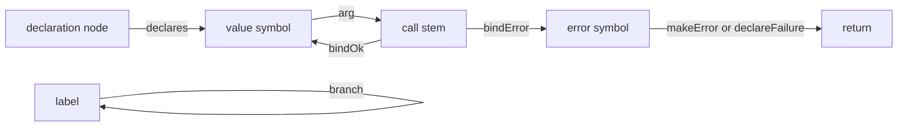

## Whole Program Graph

```mermaid
flowchart TD
  Root["experiments.refinedSyntaxExample"]

  Root -->|"section"| StringStdlib["stdlib.string.agentFacing"]
  Root -->|"section"| TextStdlib["stdlib.text.agentFacing"]
  Root -->|"section"| TimeStdlib["stdlib.time.agentFacing"]
  Root -->|"section"| MemoryStdlib["stdlib.memory.agentFacing"]
  Root -->|"section"| MetricsStdlib["stdlib.metrics.agentFacing"]
  Root -->|"section"| SignalStdlib["stdlib.signal.agentFacing"]
  Root -->|"section"| Types["experiments.types"]
  Root -->|"section"| Errors["experiments.errors"]
  Root -->|"section"| Codecs["experiments.codecs"]
  Root -->|"section"| Literals["experiments.literalsAndConstants"]
  Root -->|"section"| AggregateLiterals["experiments.aggregateLiterals"]
  Root -->|"section"| LongLiterals["experiments.longLiterals"]
  Root -->|"section"| RetryPolicy["experiments.retryPolicy"]
  Root -->|"section"| ModuleState["experiments.moduleState"]
  Root -->|"section"| SharedState["experiments.sharedState"]
  Root -->|"section"| AggregateOps["experiments.operations.aggregates"]
  Root -->|"section"| EdgeCoverageOps["experiments.operations.edgeCoverage"]
  Root -->|"section"| ValidationOps["experiments.operations.validation"]
  Root -->|"section"| LookupOps["experiments.operations.lookup"]
  Root -->|"section"| ResponseOps["experiments.operations.response"]
  Root -->|"section"| SmokeString["stdlib.string.smokeTest"]
  Root -->|"section"| SmokeMemory["stdlib.memory.smokeTest"]
  Root -->|"section"| SmokeTime["stdlib.time.smokeTest"]

  StringStdlib -->|"operation"| compareCString
  StringStdlib -->|"operation"| stringByteLength
  StringStdlib -->|"operation"| validateCString
  TextStdlib -->|"operation"| validateUtf8Text
  TimeStdlib -->|"operation"| isLeapYearAsCInt
  TimeStdlib -->|"operation"| isLeapYear
  MemoryStdlib -->|"operation"| copyMemoryBytes
  MetricsStdlib -->|"operation"| releaseMetricsLockGuard
  MetricsStdlib -->|"operation"| acquireMetricsLockGuard
  Types -->|"record schema"| AccountBalance
  Types -->|"record schema"| AccountBalanceResponse
  Types -->|"record schema"| Task
  Types -->|"collection schema"| TaskList
  Types -->|"collection schema"| TaskTitleList
  Types -->|"map schema"| TaskMap
  Types -->|"array schema"| FixedTaskArray
  Types -->|"slice schema"| TaskSlice
  Types -->|"small list schema"| SmallTaskList
  Types -->|"constructor operation"| createAccountBalanceResponseRecord
  Codecs -->|"codec schema"| AccountBalanceResponseJsonCodec
  Codecs -->|"codec schema"| TaskJsonCodec
  Literals -->|"constant values"| ConstantPool
  AggregateLiterals -->|"list literal"| defaultTaskTitles
  LongLiterals -->|"external literal metadata"| accountLookupFailureTemplate
  LongLiterals -->|"external literal metadata"| accountBalanceJsonTemplate
  RetryPolicy -->|"policy"| accountLookupRetryPolicy
  ModuleState -->|"module storage"| lastAccountLookupRevision
  SharedState -->|"guarded mutable state"| accountLookupFailureCount
  AggregateOps -->|"operation"| buildTaskWithBuilder
  AggregateOps -->|"operation"| appendAndReadTask
  AggregateOps -->|"operation"| countCompletedTasks
  EdgeCoverageOps -->|"operation"| validateRuntimeTaskTitle
  EdgeCoverageOps -->|"operation"| decodeTaskJson
  EdgeCoverageOps -->|"operation"| encodeAccountBalanceResponseJson
  EdgeCoverageOps -->|"operation"| measureLookupFailureTemplate
  EdgeCoverageOps -->|"operation"| insertAndReadTaskMap
  EdgeCoverageOps -->|"operation"| readTaskFromSlice
  EdgeCoverageOps -->|"operation"| readFixedTaskArrayItem
  EdgeCoverageOps -->|"operation"| appendSmallTaskList
  ValidationOps -->|"operation"| validateAccountLabel
  LookupOps -->|"operation"| getAccountBalanceWithRetry
  ResponseOps -->|"operation"| buildAccountBalanceResponse
  SmokeString -->|"operation"| compareCStringSmokeTest
  SmokeMemory -->|"operation"| copyMemoryBytesSmokeTest
  SmokeTime -->|"operation"| leapYearSmokeTest
```

## Type, Trust, Aggregate, and State Graph

```mermaid
flowchart TD
  RawCStringPointer -->|"trustBoundaryInput"| CNullTerminatedByteString
  validateCString -->|"trustBoundaryValidator"| CNullTerminatedByteString
  CNullTerminatedByteString -->|"trustBoundaryOutput"| CNullTerminatedByteString
  TrustedStaticLiteral["trustedStaticLiteral"] -->|"trustBoundarySource"| CNullTerminatedByteString
  TrustedExternalCString["trustedExternalCNullTerminatedUtf8Source"] -->|"trustBoundarySource"| CNullTerminatedByteString

  RawUtf8Text -->|"trustBoundaryInput"| ValidatedText
  validateUtf8Text -->|"trustBoundaryValidator"| ValidatedText
  TrustedUtf8Literal["trustedUtf8Literal"] -->|"trustBoundarySource"| ValidatedText
  ValidatedText -->|"type"| TaskTitle

  AccountBalance -->|"field"| AccountBalance_accountId["accountId: AccountId"]
  AccountBalance -->|"field"| AccountBalance_availableCents["availableCents: I64"]
  AccountBalance -->|"field"| AccountBalance_pendingCents["pendingCents: I64"]
  AccountBalance -->|"field"| AccountBalance_updatedAtUtc["updatedAtUtc: UtcMilliseconds"]

  AccountBalanceResponse -->|"field"| Response_accountId["accountId: AccountId"]
  AccountBalanceResponse -->|"field"| Response_availableCents["availableCents: I64"]
  AccountBalanceResponse -->|"field"| Response_pendingCents["pendingCents: I64"]
  AccountBalanceResponse -->|"field"| Response_displayText["displayText: CNullTerminatedByteString"]

  Task -->|"field"| Task_id["id: TaskId"]
  Task -->|"field"| Task_title["title: TaskTitle"]
  Task -->|"field"| Task_completed["completed: Bool"]

  TaskList -->|"element"| Task
  TaskList -->|"allocator"| ArenaRequest["arena.request"]
  TaskList -->|"operation"| TaskListLength["TaskList.length"]
  TaskList -->|"operation"| TaskListAppend["TaskList.append"]
  TaskList -->|"operation"| TaskListGet["TaskList.get"]
  TaskList -->|"operation"| TaskListSlice["TaskList.slice"]
  TaskListAppend -->|"mutation"| ImmutableUpdate["immutableUpdate"]
  TaskListAppend -->|"allocation"| ArenaRequest
  TaskListSlice -->|"mutation"| BorrowedView["borrowedView"]
  TaskSlice -->|"element"| Task
  TaskSlice -->|"operation"| TaskSliceGet["TaskSlice.get"]
  FixedTaskArray -->|"element"| Task
  FixedTaskArray -->|"length"| fixedTaskArrayLength
  FixedTaskArray -->|"operation"| FixedTaskArrayGet["FixedTaskArray.get"]
  SmallTaskList -->|"element"| Task
  SmallTaskList -->|"inlineCapacity"| smallTaskListInlineCapacity
  SmallTaskList -->|"spillAllocator"| ArenaRequest
  SmallTaskList -->|"operation"| SmallTaskListAppend["SmallTaskList.append"]
  SmallTaskListAppend -->|"allocation"| ArenaRequest
  SmallTaskListAppend -->|"mutation"| ImmutableUpdate
  TaskMap -->|"key"| TaskId
  TaskMap -->|"value"| Task
  TaskMap -->|"allocator"| ArenaProcess["arena.process"]
  TaskMap -->|"operation"| TaskMapInsert["TaskMap.insert"]
  TaskMap -->|"operation"| TaskMapGet["TaskMap.get"]
  TaskMapInsert -->|"allocation"| ArenaProcess
  TaskMapInsert -->|"mutation"| ImmutableUpdate
  TaskTitleList -->|"element"| TaskTitle
  TaskTitleList -->|"allocator"| ArenaStatic["arena.static"]
  defaultTaskTitles -->|"item 0"| setupTaskTitle
  defaultTaskTitles -->|"item 1"| writeTestsTaskTitle
  defaultTaskTitles -->|"item 2"| runServerTaskTitle

  accountLookupRetryPolicy -->|"maxAttempts"| requestRetryLimit
  accountLookupRetryPolicy -->|"initialDelay"| accountLookupRetryInitialDelay
  accountLookupRetryPolicy -->|"maximumDelay"| accountLookupRetryMaximumDelay
  accountLookupRetryPolicy -->|"jitter"| RetryJitterYes["yes"]

  accountLookupFailureCount -->|"owner"| metricsRuntime
  accountLookupFailureCount -->|"guard"| metricsLock
  lastAccountLookupRevision -->|"ownedBy"| moduleStateOwner

  RawJsonBytes -->|"decode"| JsonDecodeTask["json.decode.Task"]
  JsonDecodeTask -->|"bindOk"| Task
  AccountBalanceResponse -->|"encode"| JsonEncodeAccountBalanceResponse["json.encode.AccountBalanceResponse"]
  JsonEncodeAccountBalanceResponse -->|"bindOk"| JsonBytes
  accountLookupFailureTemplate -->|"arg inputText"| stringByteLength
```

## Cross-Operation Call Graph

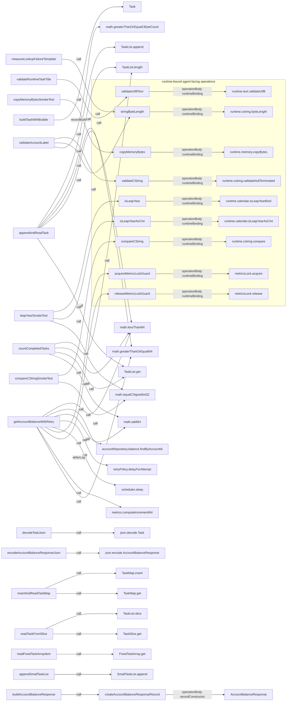

## buildTaskWithBuilder Graph

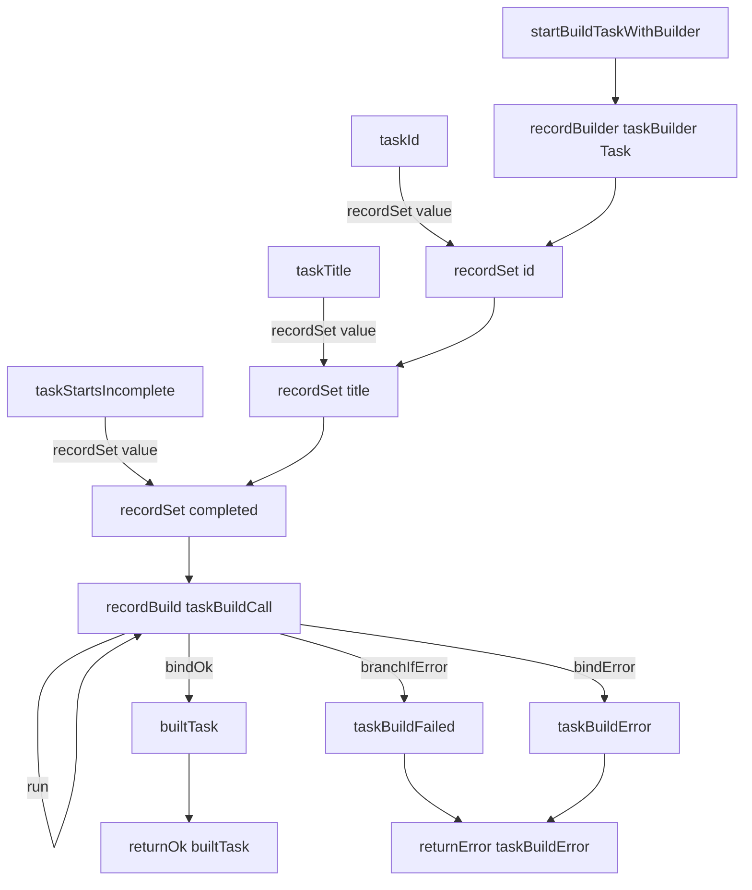

## appendAndReadTask Graph

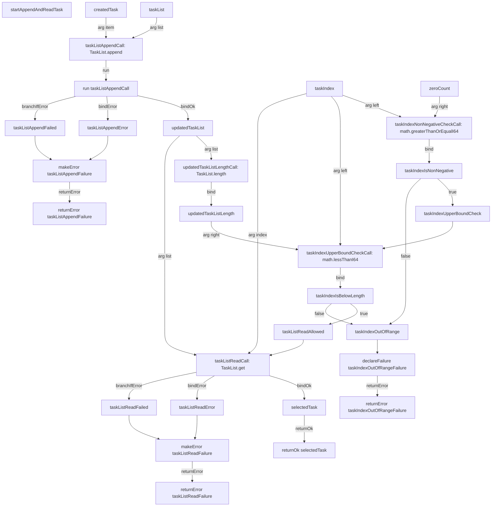

## countCompletedTasks Graph

```mermaid
flowchart TD
  Start["startCountCompletedTasks"]
  taskList -->|"arg list"| LengthCall["taskIterationLengthCall: TaskList.length"]
  LengthCall -->|"bind"| taskIterationLength
  Start --> taskIterationIndex["storage local mutable taskIterationIndex = zeroCount"]
  Start --> completedTaskCount["storage local mutable completedTaskCount = zeroCount"]

  LoopHead["completedTaskLoopHead"]
  taskIterationIndex -->|"arg left"| RangeCall["taskIterationRangeCheckCall: math.lessThanI64"]
  taskIterationLength -->|"arg right"| RangeCall
  RangeCall -->|"bind"| taskIterationInRange
  taskIterationInRange -->|"true"| LoopBody["completedTaskLoopBody"]
  taskIterationInRange -->|"false"| LoopFinished["completedTaskLoopFinished"]

  LoopBody --> ReadCall["currentTaskReadCall: TaskList.get"]
  taskList -->|"arg list"| ReadCall
  taskIterationIndex -->|"arg index"| ReadCall
  ReadCall -->|"bindOk"| currentTask
  ReadCall -->|"bindError"| currentTaskReadError
  ReadCall -->|"branchIfError"| currentTaskReadFailed

  currentTask -->|"fieldGet completed"| currentTaskCompleted
  currentTaskCompleted -->|"true"| IncrementRequired["completedTaskIncrementRequired"]
  currentTaskCompleted -->|"false"| IndexAdvance["completedTaskIndexAdvance"]

  IncrementRequired --> CountIncCall["completedTaskCountIncrementCall: math.addI64"]
  completedTaskCount -->|"arg left"| CountIncCall
  oneStep -->|"arg right"| CountIncCall
  CountIncCall -->|"bind"| nextCompletedTaskCount
  nextCompletedTaskCount -->|"set local"| completedTaskCount
  completedTaskCount --> IndexAdvance

  IndexAdvance --> IndexIncCall["taskIterationIndexAdvanceCall: math.addI64"]
  taskIterationIndex -->|"arg left"| IndexIncCall
  oneStep -->|"arg right"| IndexIncCall
  IndexIncCall -->|"bind"| nextTaskIterationIndex
  nextTaskIterationIndex -->|"set local"| taskIterationIndex
  taskIterationIndex -->|"branch"| LoopHead

  LoopFinished -->|"returnOk"| ReturnCount["returnOk completedTaskCount"]
  currentTaskReadFailed --> MakeReadFailure["makeError currentTaskReadFailure"]
  currentTaskReadError --> MakeReadFailure
  MakeReadFailure -->|"returnError"| ReturnReadFailure["returnError currentTaskReadFailure"]
```

## Edge Coverage Operations Graph

```mermaid
flowchart TD
  rawTitle -->|"arg candidateText"| RuntimeTitleCall["runtimeTaskTitleValidationCall: validateUtf8Text"]
  RuntimeTitleCall -->|"bindOk"| runtimeTaskTitle
  RuntimeTitleCall -->|"bindError"| runtimeTaskTitleValidationError
  RuntimeTitleCall -->|"branchIfError"| runtimeTaskTitleValidationFailed
  runtimeTaskTitle -->|"returnOk"| ReturnRuntimeTitle["returnOk runtimeTaskTitle"]
  runtimeTaskTitleValidationFailed -->|"returnError"| runtimeTaskTitleValidationError

  taskJsonBytes -->|"arg bytes"| TaskJsonDecodeCall["taskJsonDecodeCall: json.decode.Task"]
  TaskJsonDecodeCall -->|"bindOk"| decodedTask
  TaskJsonDecodeCall -->|"bindError"| taskJsonDecodeError
  TaskJsonDecodeCall -->|"branchIfError"| taskJsonDecodeFailed
  decodedTask -->|"returnOk"| ReturnDecodedTask["returnOk decodedTask"]
  taskJsonDecodeFailed -->|"returnError"| taskJsonDecodeError

  accountBalanceResponse -->|"arg value"| ResponseJsonEncodeCall["accountBalanceResponseJsonEncodeCall: json.encode.AccountBalanceResponse"]
  ResponseJsonEncodeCall -->|"bindOk"| accountBalanceResponseJson
  ResponseJsonEncodeCall -->|"bindError"| accountBalanceResponseJsonEncodeError
  ResponseJsonEncodeCall -->|"branchIfError"| accountBalanceResponseJsonEncodeFailed
  accountBalanceResponseJson -->|"returnOk"| ReturnEncodedResponse["returnOk accountBalanceResponseJson"]
  accountBalanceResponseJsonEncodeFailed -->|"returnError"| accountBalanceResponseJsonEncodeError

  accountLookupFailureTemplate -->|"arg inputText"| TemplateLengthCall["lookupFailureTemplateLengthCall: stringByteLength"]
  TemplateLengthCall -->|"bindOk"| lookupFailureTemplateByteLength
  TemplateLengthCall -->|"bindError"| lookupFailureTemplateLengthError
  TemplateLengthCall -->|"branchIfError"| lookupFailureTemplateLengthFailed
  lookupFailureTemplateByteLength -->|"returnOk"| ReturnTemplateLength["returnOk lookupFailureTemplateByteLength"]
  lookupFailureTemplateLengthFailed -->|"returnError"| lookupFailureTemplateLengthError

  taskMap -->|"arg map"| TaskMapInsertCall["taskMapInsertCall: TaskMap.insert"]
  taskId -->|"arg key"| TaskMapInsertCall
  taskValue -->|"arg value"| TaskMapInsertCall
  TaskMapInsertCall -->|"bindOk"| updatedTaskMap
  TaskMapInsertCall -->|"bindError"| taskMapInsertError
  TaskMapInsertCall -->|"branchIfError"| taskMapInsertFailed
  updatedTaskMap -->|"arg map"| TaskMapReadCall["taskMapReadCall: TaskMap.get"]
  taskId -->|"arg key"| TaskMapReadCall
  TaskMapReadCall -->|"bindOk"| mappedTask
  TaskMapReadCall -->|"bindError"| taskMapReadError
  TaskMapReadCall -->|"branchIfError"| taskMapReadFailed
  mappedTask -->|"returnOk"| ReturnMappedTask["returnOk mappedTask"]
  taskMapInsertFailed --> MakeMapInsertFailure["makeError taskMapInsertFailure"]
  taskMapInsertError --> MakeMapInsertFailure
  MakeMapInsertFailure -->|"returnError"| ReturnMapInsertFailure["returnError taskMapInsertFailure"]
  taskMapReadFailed --> MakeMapReadFailure["makeError taskMapReadFailure"]
  taskMapReadError --> MakeMapReadFailure
  MakeMapReadFailure -->|"returnError"| ReturnMapReadFailure["returnError taskMapReadFailure"]

  taskList -->|"arg list"| TaskSliceCreateCall["taskSliceCreateCall: TaskList.slice"]
  sliceStartIndex -->|"arg startIndex"| TaskSliceCreateCall
  sliceLength -->|"arg length"| TaskSliceCreateCall
  TaskSliceCreateCall -->|"bindOk"| taskSlice
  TaskSliceCreateCall -->|"bindError"| taskSliceCreateError
  TaskSliceCreateCall -->|"branchIfError"| taskSliceCreateFailed
  taskSlice -->|"arg slice"| TaskSliceReadCall["taskSliceReadCall: TaskSlice.get"]
  sliceReadIndex -->|"arg index"| TaskSliceReadCall
  TaskSliceReadCall -->|"bindOk"| slicedTask
  TaskSliceReadCall -->|"bindError"| taskSliceReadError
  TaskSliceReadCall -->|"branchIfError"| taskSliceReadFailed
  slicedTask -->|"returnOk"| ReturnSlicedTask["returnOk slicedTask"]
  taskSliceCreateFailed --> MakeSliceCreateFailure["makeError taskSliceCreateFailure"]
  taskSliceCreateError --> MakeSliceCreateFailure
  MakeSliceCreateFailure -->|"returnError"| ReturnSliceCreateFailure["returnError taskSliceCreateFailure"]
  taskSliceReadFailed --> MakeSliceReadFailure["makeError taskSliceReadFailure"]
  taskSliceReadError --> MakeSliceReadFailure
  MakeSliceReadFailure -->|"returnError"| ReturnSliceReadFailure["returnError taskSliceReadFailure"]

  fixedTaskArray -->|"arg array"| FixedArrayReadCall["fixedTaskArrayReadCall: FixedTaskArray.get"]
  taskIndex -->|"arg index"| FixedArrayReadCall
  FixedArrayReadCall -->|"bindOk"| fixedArrayTask
  FixedArrayReadCall -->|"bindError"| fixedTaskArrayReadError
  FixedArrayReadCall -->|"branchIfError"| fixedTaskArrayReadFailed
  fixedArrayTask -->|"returnOk"| ReturnFixedArrayTask["returnOk fixedArrayTask"]
  fixedTaskArrayReadFailed --> MakeFixedArrayFailure["makeError fixedTaskArrayReadFailure"]
  fixedTaskArrayReadError --> MakeFixedArrayFailure
  MakeFixedArrayFailure -->|"returnError"| ReturnFixedArrayFailure["returnError fixedTaskArrayReadFailure"]

  smallTaskList -->|"arg list"| SmallTaskListAppendCall["smallTaskListAppendCall: SmallTaskList.append"]
  createdTask -->|"arg item"| SmallTaskListAppendCall
  SmallTaskListAppendCall -->|"bindOk"| updatedSmallTaskList
  SmallTaskListAppendCall -->|"bindError"| smallTaskListAppendError
  SmallTaskListAppendCall -->|"branchIfError"| smallTaskListAppendFailed
  updatedSmallTaskList -->|"returnOk"| ReturnSmallTaskList["returnOk updatedSmallTaskList"]
  smallTaskListAppendFailed --> MakeSmallListFailure["makeError smallTaskListAppendFailure"]
  smallTaskListAppendError --> MakeSmallListFailure
  MakeSmallListFailure -->|"returnError"| ReturnSmallListFailure["returnError smallTaskListAppendFailure"]
```

## validateAccountLabel Graph

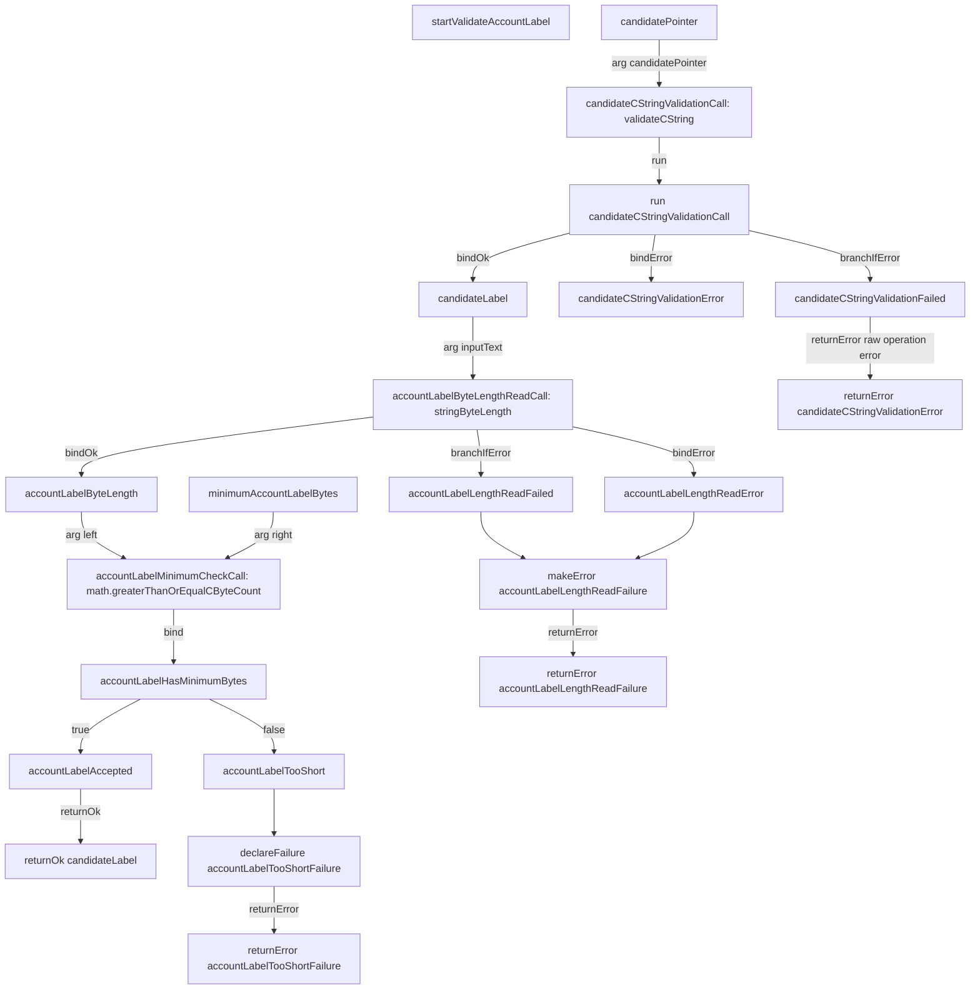

## getAccountBalanceWithRetry Graph

```mermaid
flowchart TD
  Start["startGetAccountBalanceWithRetry"]
  Start --> lookupAttemptLimit["storage local immutable lookupAttemptLimit = requestRetryLimit"]
  Start --> lookupAttemptIndex["storage local mutable lookupAttemptIndex = firstAttemptIndex"]

  Loop["accountLookupAttemptLoop"]
  lookupAttemptIndex -->|"arg left"| LimitCall["accountLookupLimitCheckCall: math.lessThanI64"]
  lookupAttemptLimit -->|"arg right"| LimitCall
  LimitCall -->|"bind"| lookupAttemptsRemain
  lookupAttemptsRemain -->|"true"| AttemptAllowed["accountLookupAttemptAllowed"]
  lookupAttemptsRemain -->|"false"| AttemptsExhausted["accountLookupAttemptsExhausted"]

  AttemptAllowed --> LookupCall["accountBalanceLookupCall: accountRepository.balance.findByAccountId"]
  normalizedAccountId -->|"arg accountId"| LookupCall
  lookupAttemptIndex -->|"arg attemptIndex"| LookupCall
  accountLookupCancellationToken -->|"cancelOn"| LookupCall
  accountLookupAttemptTimeout -->|"timeout"| LookupCall
  LookupCall -->|"start"| LookupStarted["start accountBalanceLookupCall"]
  LookupStarted -->|"await"| LookupAwaited["await accountBalanceLookupCall"]
  LookupAwaited -->|"bindOk"| accountBalance
  LookupAwaited -->|"bindError"| accountBalanceLookupError
  LookupAwaited -->|"branchIfError"| LookupFailed["accountBalanceLookupFailed"]
  accountBalance -->|"branch"| LookupSucceeded["accountBalanceLookupSucceeded"]

  LookupFailed --> AdvanceCall["lookupAttemptAdvanceCall: math.addI64"]
  lookupAttemptIndex -->|"arg left"| AdvanceCall
  oneStep -->|"arg right"| AdvanceCall
  AdvanceCall -->|"bind"| nextLookupAttemptIndex
  nextLookupAttemptIndex -->|"set local"| lookupAttemptIndex

  nextLookupAttemptIndex -->|"arg left"| ContinueCall["accountLookupRetryContinuationCheckCall: math.lessThanI64"]
  lookupAttemptLimit -->|"arg right"| ContinueCall
  ContinueCall -->|"bind"| retryAttemptsRemainAfterFailure
  retryAttemptsRemainAfterFailure -->|"true"| DelayReady["accountLookupRetryDelayReady"]
  retryAttemptsRemainAfterFailure -->|"false"| AttemptsExhausted

  DelayReady --> DelayComputeCall["accountLookupRetryDelayComputeCall: retryPolicy.delayForAttempt"]
  accountLookupRetryPolicy -->|"arg policy"| DelayComputeCall
  lookupAttemptIndex -->|"arg attemptIndex"| DelayComputeCall
  DelayComputeCall -->|"bindOk"| accountLookupRetryDelayDuration
  DelayComputeCall -->|"bindError"| accountLookupRetryDelayComputeError
  DelayComputeCall -->|"branchIfError"| DelayComputeFailed["accountLookupRetryDelayComputeFailed"]

  accountLookupRetryDelayDuration -->|"arg duration"| DelayCall["accountLookupRetryDelayCall: scheduler.sleep"]
  accountLookupCancellationToken -->|"cancelOn"| DelayCall
  DelayCall -->|"start"| DelayStarted["start accountLookupRetryDelayCall"]
  DelayStarted -->|"await"| DelayAwaited["await accountLookupRetryDelayCall"]
  DelayAwaited -->|"ignoreOk"| DelayVoid["Void"]
  DelayAwaited -->|"bindError"| accountLookupRetryDelayError
  DelayAwaited -->|"branchIfError"| DelayFailed["accountLookupRetryDelayFailed"]
  DelayAwaited -->|"branch success"| Loop

  AttemptsExhausted --> DeclareAttempts["declareFailure accountLookupAttemptsExhaustedFailure"]
  DeclareAttempts --> MetricsEnabledCheck["branchIf accountLookupFailureMetricsEnabled"]
  accountLookupFailureMetricsEnabled -->|"true"| MetricWriteRequired["accountLookupMetricWriteRequired"]
  accountLookupFailureMetricsEnabled -->|"false"| FailureReturn["accountLookupFailureReturn"]

  MetricWriteRequired --> GuardAcquireCall["accountLookupGuardAcquireCall: acquireMetricsLockGuard"]
  metricsRuntime -->|"arg runtime"| GuardAcquireCall
  accountLookupFailureCount -->|"arg sharedState"| GuardAcquireCall
  GuardAcquireCall -->|"bindOk"| accountLookupGuardToken
  GuardAcquireCall -->|"bindError"| accountLookupGuardAcquireError
  GuardAcquireCall -->|"branchIfError"| GuardAcquireFailed["accountLookupGuardAcquireFailed"]
  accountLookupGuardToken -->|"deferLog releaseMetricsLockGuard"| metricsLockReleaseDefer
  metricsLockReleaseDefer -->|"deferLogSink"| CleanupSink["cleanup.metricsLockRelease"]

  accountLookupGuardToken -->|"protectedBy"| SharedRead["read sharedState accountLookupFailureCurrentCount"]
  accountLookupFailureCount -->|"read"| SharedRead
  SharedRead --> accountLookupFailureCurrentCount

  accountLookupFailureCurrentCount -->|"arg current"| MetricIncrementCall["accountLookupFailureMetricIncrementCall: metrics.computeIncrementI64"]
  metricsRuntime -->|"arg runtime"| MetricIncrementCall
  oneStep -->|"arg step"| MetricIncrementCall
  MetricIncrementCall -->|"bindOk"| nextFailureCount
  MetricIncrementCall -->|"bindError"| accountLookupFailureMetricIncrementError
  MetricIncrementCall -->|"branchIfError"| MetricFailed["accountLookupFailureMetricFailed"]
  nextFailureCount -->|"set sharedState protectedBy accountLookupGuardToken"| accountLookupFailureCount
  accountLookupFailureCount -->|"branch"| FailureReturn
  FailureReturn -->|"returnError"| ReturnAttempts["returnError accountLookupAttemptsExhaustedFailure"]

  MetricFailed --> MakeMetricFailure["makeError accountLookupFailureMetricFailure"]
  accountLookupFailureMetricIncrementError --> MakeMetricFailure
  MakeMetricFailure -->|"returnError"| ReturnMetricFailure["returnError accountLookupFailureMetricFailure"]

  GuardAcquireFailed --> MakeGuardFailure["makeError accountLookupGuardAcquireFailure"]
  accountLookupGuardAcquireError --> MakeGuardFailure
  MakeGuardFailure -->|"returnError"| ReturnGuardFailure["returnError accountLookupGuardAcquireFailure"]

  DelayComputeFailed --> MakeDelayComputeFailure["makeError accountLookupRetryDelayComputeFailure"]
  accountLookupRetryDelayComputeError --> MakeDelayComputeFailure
  MakeDelayComputeFailure -->|"returnError"| ReturnDelayComputeFailure["returnError accountLookupRetryDelayComputeFailure"]

  DelayFailed --> MakeDelayFailure["makeError accountLookupRetryDelayFailure"]
  accountLookupRetryDelayError --> MakeDelayFailure
  MakeDelayFailure -->|"returnError"| ReturnDelayFailure["returnError accountLookupRetryDelayFailure"]

  LookupSucceeded --> availableBalanceValue["fieldGet availableBalanceValue"]
  accountBalance -->|"field availableCents"| availableBalanceValue
  availableBalanceValue -->|"arg left"| BalanceCheckCall["availableBalanceNonNegativeCheckCall: math.greaterThanOrEqualI64"]
  zeroCount -->|"arg right"| BalanceCheckCall
  BalanceCheckCall -->|"bind"| availableBalanceIsNonNegative
  availableBalanceIsNonNegative -->|"true"| BalanceAccepted["accountBalanceAccepted"]
  availableBalanceIsNonNegative -->|"false"| BalanceValidationFailed["accountBalanceValidationFailed"]

  BalanceAccepted --> RevisionCall["moduleRevisionIncrementCall: math.addI64"]
  lastAccountLookupRevision -->|"arg left"| RevisionCall
  oneStep -->|"arg right"| RevisionCall
  RevisionCall -->|"bind"| nextAccountLookupRevision
  nextAccountLookupRevision -->|"set module ownedBy moduleStateOwner"| lastAccountLookupRevision
  accountBalance -->|"returnOk"| ReturnBalance["returnOk accountBalance"]

  BalanceValidationFailed --> DeclareBalanceFailure["declareFailure accountBalanceValidationFailure"]
  DeclareBalanceFailure -->|"returnError"| ReturnBalanceFailure["returnError accountBalanceValidationFailure"]
```

## buildAccountBalanceResponse Graph

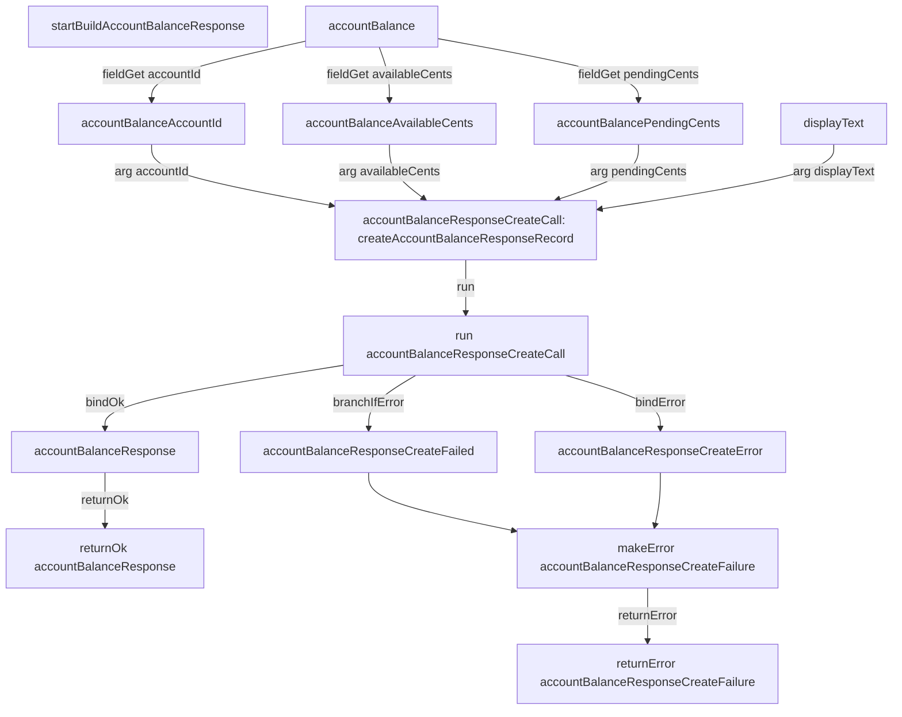

## Smoke Test Graphs

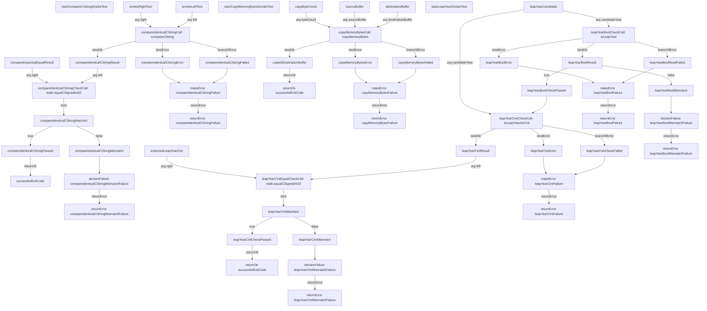

## Call Edge Coverage Table

| Source operation | Call stem | Target | Covered by graph |
| --- | --- | --- | --- |
| `appendAndReadTask` | `taskListAppendCall` | `TaskList.append` | `appendAndReadTask Graph` |
| `appendAndReadTask` | `updatedTaskListLengthCall` | `TaskList.length` | `appendAndReadTask Graph` |
| `appendAndReadTask` | `taskIndexNonNegativeCheckCall` | `math.greaterThanOrEqualI64` | `appendAndReadTask Graph` |
| `appendAndReadTask` | `taskIndexUpperBoundCheckCall` | `math.lessThanI64` | `appendAndReadTask Graph` |
| `appendAndReadTask` | `taskListReadCall` | `TaskList.get` | `appendAndReadTask Graph` |
| `countCompletedTasks` | `taskIterationLengthCall` | `TaskList.length` | `countCompletedTasks Graph` |
| `countCompletedTasks` | `taskIterationRangeCheckCall` | `math.lessThanI64` | `countCompletedTasks Graph` |
| `countCompletedTasks` | `currentTaskReadCall` | `TaskList.get` | `countCompletedTasks Graph` |
| `countCompletedTasks` | `completedTaskCountIncrementCall` | `math.addI64` | `countCompletedTasks Graph` |
| `countCompletedTasks` | `taskIterationIndexAdvanceCall` | `math.addI64` | `countCompletedTasks Graph` |
| `validateRuntimeTaskTitle` | `runtimeTaskTitleValidationCall` | `validateUtf8Text` | `Edge Coverage Operations Graph` |
| `decodeTaskJson` | `taskJsonDecodeCall` | `json.decode.Task` | `Edge Coverage Operations Graph` |
| `encodeAccountBalanceResponseJson` | `accountBalanceResponseJsonEncodeCall` | `json.encode.AccountBalanceResponse` | `Edge Coverage Operations Graph` |
| `measureLookupFailureTemplate` | `lookupFailureTemplateLengthCall` | `stringByteLength` | `Edge Coverage Operations Graph` |
| `insertAndReadTaskMap` | `taskMapInsertCall` | `TaskMap.insert` | `Edge Coverage Operations Graph` |
| `insertAndReadTaskMap` | `taskMapReadCall` | `TaskMap.get` | `Edge Coverage Operations Graph` |
| `readTaskFromSlice` | `taskSliceCreateCall` | `TaskList.slice` | `Edge Coverage Operations Graph` |
| `readTaskFromSlice` | `taskSliceReadCall` | `TaskSlice.get` | `Edge Coverage Operations Graph` |
| `readFixedTaskArrayItem` | `fixedTaskArrayReadCall` | `FixedTaskArray.get` | `Edge Coverage Operations Graph` |
| `appendSmallTaskList` | `smallTaskListAppendCall` | `SmallTaskList.append` | `Edge Coverage Operations Graph` |
| `validateAccountLabel` | `candidateCStringValidationCall` | `validateCString` | `validateAccountLabel Graph` |
| `validateAccountLabel` | `accountLabelByteLengthReadCall` | `stringByteLength` | `validateAccountLabel Graph` |
| `validateAccountLabel` | `accountLabelMinimumCheckCall` | `math.greaterThanOrEqualCByteCount` | `validateAccountLabel Graph` |
| `getAccountBalanceWithRetry` | `accountLookupLimitCheckCall` | `math.lessThanI64` | `getAccountBalanceWithRetry Graph` |
| `getAccountBalanceWithRetry` | `accountBalanceLookupCall` | `accountRepository.balance.findByAccountId` | `getAccountBalanceWithRetry Graph` |
| `getAccountBalanceWithRetry` | `lookupAttemptAdvanceCall` | `math.addI64` | `getAccountBalanceWithRetry Graph` |
| `getAccountBalanceWithRetry` | `accountLookupRetryContinuationCheckCall` | `math.lessThanI64` | `getAccountBalanceWithRetry Graph` |
| `getAccountBalanceWithRetry` | `accountLookupRetryDelayComputeCall` | `retryPolicy.delayForAttempt` | `getAccountBalanceWithRetry Graph` |
| `getAccountBalanceWithRetry` | `accountLookupRetryDelayCall` | `scheduler.sleep` | `getAccountBalanceWithRetry Graph` |
| `getAccountBalanceWithRetry` | `accountLookupGuardAcquireCall` | `acquireMetricsLockGuard` | `getAccountBalanceWithRetry Graph` |
| `getAccountBalanceWithRetry` | `accountLookupFailureMetricIncrementCall` | `metrics.computeIncrementI64` | `getAccountBalanceWithRetry Graph` |
| `getAccountBalanceWithRetry` | `availableBalanceNonNegativeCheckCall` | `math.greaterThanOrEqualI64` | `getAccountBalanceWithRetry Graph` |
| `getAccountBalanceWithRetry` | `moduleRevisionIncrementCall` | `math.addI64` | `getAccountBalanceWithRetry Graph` |
| `buildAccountBalanceResponse` | `accountBalanceResponseCreateCall` | `createAccountBalanceResponseRecord` | `buildAccountBalanceResponse Graph` |
| `compareCStringSmokeTest` | `compareIdenticalCStringCall` | `compareCString` | `Smoke Test Graphs` |
| `compareCStringSmokeTest` | `compareIdenticalCStringCheckCall` | `math.equalCSignedInt32` | `Smoke Test Graphs` |
| `copyMemoryBytesSmokeTest` | `copyMemoryBytesCall` | `copyMemoryBytes` | `Smoke Test Graphs` |
| `leapYearSmokeTest` | `leapYearBoolCheckCall` | `isLeapYear` | `Smoke Test Graphs` |
| `leapYearSmokeTest` | `leapYearCIntCheckCall` | `isLeapYearAsCInt` | `Smoke Test Graphs` |
| `leapYearSmokeTest` | `leapYearCIntEqualCheckCall` | `math.equalCSignedInt32` | `Smoke Test Graphs` |

## Adequacy Readout

The sample syntax is adequate for these graph edge families:

| Edge family | Adequacy result |
| --- | --- |
| Operation contract edges | Strong: inputs, outputs, effects, memory, async, purpose, invariant, and body source are individually addressable. |
| Runtime binding edges | Strong: binding target, preconditions, and failures are explicit. |
| Trust-boundary edges | Strong: raw-to-validated transitions are visible for C strings and validated text, including runtime UTF-8 validation. |
| Record edges | Strong: schemas, field reads, constructors, and builder construction are all graphable. |
| Collection edges | Strong: list, map, slice, fixed-array, and small-list operation contracts are explicit and exercised by calls. |
| Codec edges | Strong: JSON codec declarations are exercised through decode and encode calls. |
| Dataflow edges | Strong: every call argument and bind has a stable call stem. |
| Control-flow edges | Strong: labels, branches, branch predicates, branch-if-error, and returns are graphable. |
| Failure edges | Strong: raw errors and domain failures are separate through `bindError`, `groupError`, `makeError`, `declareFailure`, and `returnError`. |
| Async edges | Strong in the retry path: `cancelOn`, `timeout`, `start`, `await`, `ignoreOk`, and scheduler effects are visible. |
| State edges | Strong: local mutation, module mutation, shared-state read/write, guard token, ownership, and cleanup defer are explicit. |
| Long-literal edges | Strong: external literal metadata is exercised by a concrete length-read call. |

Previously declared-only surfaces are now exercised:

| Surface | Exercised by |
| --- | --- |
| `jsonCodec` | `taskJsonDecodeCall` and `accountBalanceResponseJsonEncodeCall`. |
| `TaskMap` | `taskMapInsertCall` and `taskMapReadCall`. |
| `TaskSlice` | `taskSliceCreateCall` and `taskSliceReadCall`. |
| `FixedTaskArray` | `fixedTaskArrayReadCall`. |
| `SmallTaskList` | `smallTaskListAppendCall`. |
| Long literals | `lookupFailureTemplateLengthCall`. |
| `validateUtf8Text` | `runtimeTaskTitleValidationCall`. |

## Verdict

The graph shows the syntax is adequate for the main goal: every meaningful runtime edge in the sample can be represented as an atomic, named line and recovered into a graph.

The current sample now exercises all previously declared aggregate and codec surfaces. The remaining design work is not edge coverage; it is formalizing these proposed verbs into the language specification with exact checker rules.
